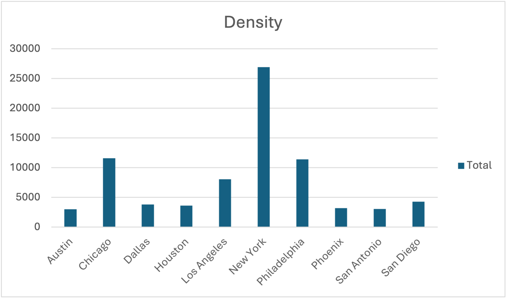

### Problem Statement
**Q1. Over the past 5 years which city has had the most hours of construction?**

_Solution_

Step 1: Loaded the file in a database and called it ‘construction’ table.
Step 2: Assumption made: A city can have more than 1 construction happening simultaneously in different parts and all the respective hours of construction are taken as a separate entity and counted.
Example: If a construction is happening from point A to B for 5 hours at on 01/01/2020 from 8am to 1 pm .
 If another construction is happening from point B to A(on opposite side)  or 5 hours at on 01/01/2020 from 8am to 1 pm  , we are considering 10 hour construction happening.

Cleaned up the data by removing all records where either of the co-ordinates is NULL

Query used:


```sql
with cte as
 (
    select city,
         construction.start_time,
         construction.end_time,
         extract(epoch from (construction.end_time - construction.start_time)) / 3600 as timediff
    from construction
    where start_lat IS NOT NULL
    or start_lng IS NOT NULL
    or end_lat IS NOT NULL
    or end_lng IS NOT NULL
)
select
    city,
    sum(timediff)
from cte
group by 1
order by 2 desc
limit 10
```

**Output**
|City            |Sum                           |
|:---------------|:----------------------------:|
|**Phoenix**     |**125727541.46166666662533769687**|
|Miami           |65558706.00916666667564671655|
|New York        |44081413.61694444442944441252|
|Chicago         |31014692.79027777776653845417|
|Brooklyn        |30084107.60555555555265498985|
|Denver          |28395521.05444444443524723236|
|Minneapolis     |23988290.31222222219134014353|
|Houston         |22310060.03249999998988505407|
|York            |21600309.05861111110599848865|
|Orlando         |19233972.8008333333622199642 |


**Phoenix** was leading with ~ 125M hours over 5 years.

---

**Q2 How has this changed over time? (please provide a chart)?**

_Solution_

```sql
with date_range as (
  select date(dt) as day
  from generate_series('2015-12-01', '2021-12-31', '1 day'::interval) dt
),
result_set as (
    select
        construction.city,
        construction.state,
        date(generate_series(construction.start_time, construction.end_time, '1 day'::interval)) as days
   from construction
   where city in ('Phoenix', 'New York', 'Los Angeles', 'Chicago', 'Houston',
                  'San Antonio', 'Philadelphia', 'San Diego', 'Dallas', 'Austin')
),
sum_hours as (
    select
        result_set.city,
        result_set.days,
        count(result_set.days) as tot
    from result_set
    group by 1, 2
),
final_number as (
    select
        date(date_trunc('month', dr.day)) as Date,
        rs.city,
        sum(rs.tot)                       as value
    from date_range dr
    left join sum_hours rs
    on dr.day = rs.days
    group by 1, 2
)
-- pivoting the table to have an easy chart representation
select
    Date,
    max(case when city = 'Phoenix' then value else 0 end) as "Phoenix",
    max(case when city = 'New York' then value else 0 end) as "New York",
    max(case when city = 'Los Angeles' then value else 0 end) as "Los Angeles",
    max(case when city = 'Chicago' then value else 0 end) as "Chicago",
    max(case when city = 'Houston' then value else 0 end) as "Houston",
    max(case when city = 'San Antonio' then value else 0 end) as "San Antonio",
    max(case when city = 'Philadelphia' then value else 0 end) as "Philadelphia",
    max(case when city = 'San Diego' then value else 0 end) as "San Diego",
    max(case when city = 'Dallas' then value else 0 end) as "Dallas",
    max(case when city = 'Austin' then value else 0 end) as "Austin"
from final_number
where value is not null
group by 1
;
```


It is also evident from the data that the number of constructions during the daytime in each city is always higher than the nighttime over the last 5 years. Only in the state of CA, it seems that the number of constructions is higher in the night time than the day time:


These could be due to several reasons for peaking construction during 2021:

1)	2020 was the year of the pandemic and Covid 19 relief funding from government was received in 2021 which might have been used for infrastructure projects.
2)	Broader efforts to simulate local economy and create jobs by investing in construction of better roads
3)	Phoenix population increased 13.5 percent from 2016 to 2021 which is double than any other 5 years
4)	Looking at the weather condition from the data it also looks like Heavy Rains/snow/ice pellets (which causes road damage) peaked in the 10 states for in 2019,2020 and 2021(since last 5 years). Since 2020 was a pandemic year, this might be the reason to have so many constructions in 2021 to improve the damaged roads.


Query to support the statement
```sql
with date_range as (
  select date(dt) as day
  from generate_series('2016-01-01', '2021-12-31', '1 day'::interval) dt
),
result_set as (
    select
        construction.city,
        construction.weather_condition,
               date(generate_series(construction.start_time, construction.end_time, '1 day'::interval)) as days
          from construction
   where
      concat(city,state) in ('PhoenixAZ', 'New YorkNY', 'Los AngelesCA', 'ChicagoIL', 'HoustonTX',
                  'San AntonioTX', 'PhiladelphiaPA', 'San DiegoCA', 'DallasTX', 'AustinTX')
   and weather_condition in ('Heavy Rain','Snow','Light Ice Pellets','Heavy Snow','Snow and Sleet / Windy','Snow and Sleet','Heavy Rain / Windy',
                         'Snow / Windy')
),
sum_hours as (
    select
                result_set.CITY,
                result_set.weather_condition,
        result_set.days,
        count(result_set.days) as tot
    from result_set
    group by 1, 2,3
)
select
    dr.day,
        rs.city,
        rs.weather_condition,
    rs.tot as value
from date_range dr
left join sum_hours rs
on dr.day = rs.days
order by 1,2,3
;

```
---

**Q3. How do the top 10 cities of USA compare?**

Metrics considered
1. Population
2. Area
3. Density
4. Weather Condition

Let’s take a look at the population change over 4 year (2020-2024) by each city area.


The chart shows that New York city has significantly more population than any of the other cities. The population has also had a huge drop of 7% over last 4 years. The graph depicts that major crowded city like NYC, LA, Chicago, Philadelphia and Dallas has seen a drop of population over the last 4 years while other less crowded cities (bigger sq mile areas- Below Chart is shown) as seen an increase in population over last 4 year with Phoenix and San Antonio topping the list. This can be a strong point as to why the construction in Phoenix increased more than any other cities in the year 2021.




The deductions made from the above data are:

1)	Construction was more than any other cities in Phoenix in 2021 because the population increased significantly than any other city.
2)	The New York city and Chicago construction volume followed closely to Phoenix in 2021 because the density of population given their much smaller size is very high and hence infrastructure needs to be maintained frequently. Also, the winter weather conditions damaged the roads in 2019,2020,2021 which added further need.

---

**Q4: Which route possesses the greatest autonomy challenges because of construction?**

Brief: I tried to take all the points in the PATH spreadsheet and joined it to Construction data to both Start and End points list to make sure that some construction is happening in the paths for last 5 years data.

Assumption made:  The start and end points will match some points in the path spreadsheet. DID NOT deep dive to include more points between the start and end points in the Construction data.

Steps:
1)	We are taking the Path excel sheet and loading it in a database. We are exploding each point as 1 row. 
```sql
with x as (
    select
        path.path_name,
        ST_DumpPoints(path_wkt) as dp,
        distance_mi
    from path
    ...
```
2)	Fetching LAT /LONG from the points:
```sql
)
,processed_path as (
    select
        path_name,
        (dp).path[1]    As index,
        ST_X((dp).geom) as lng,
        ST_Y((dp).geom) as lat
    from x
    ...
```
3)	Taking the START and END points from the construction table and accumulating those points as 1 column in a list:
```sql
with x as (select id, concat(round(start_lat::numeric, 3), round(start_lng::numeric, 3)) as point
           from construction
           where state = 'CA'
           and (start_lat IS NOT NULL
      or start_lng IS NOT NULL)
           union
           select id, concat(round(end_lat::numeric, 3), round(end_lng::numeric, 3))
           from construction
           where state = 'CA' and
            (end_lat IS NOT NULL
            or end_lng IS NOT NULL)
           order by 1)
select * from x where point is not null
...
```
4)	Comparing the points from the construction table to the points in the path table
```sql
5)	select * from path;
with x as (
    select
        path.path_name,
        ST_DumpPoints(path_wkt) as dp,
        distance_mi
    from path
)
,processed_path as (select path_name,
                           (dp).path[1]                       As index,
                           round(ST_X((dp).geom)::numeric, 3) as lng,
                           round(ST_Y((dp).geom)::numeric, 3) as lat
                    from x),
y as (select path_name, concat(lat, lng) as point1
      from processed_path),
z as (
select id, concat(round(start_lat::numeric, 3), round(start_lng::numeric, 3)) as point2
           from construction
           where state = 'CA'
             --and date_trunc('month', start_time) > '2021-01-01'::DATE
           and (start_lat IS NOT NULL
      or start_lng IS NOT NULL)
           union
           select id, concat(round(end_lat::numeric, 3), round(end_lng::numeric, 3))
           from construction
           where state = 'CA'
                -- and date_trunc('month', start_time) > '2021-01-01'::DATE
            and (end_lat IS NOT NULL
            or end_lng IS NOT NULL)
           order by 1
    )
select y.path_name, count(y.path_name)
from z
inner join y
on z.point2 = y.point1
group by 1
order by 1;
```

The results were:
```
SF -> Berkley,14677
SF -> Pacifica,14677
SF -> San Leandro,14677
SF -> San Mateo,14677
SF -> San Rafael,14677
```
The expectation was not that the number of matched points will be exactly same in all the 4 routes. However, this needs further digging to understand if the assumption is incorrect or the calculation and conversion in the query. But this approach looks reasonable3w to me according to my understanding.
Open to suggestions or alternative approach.

